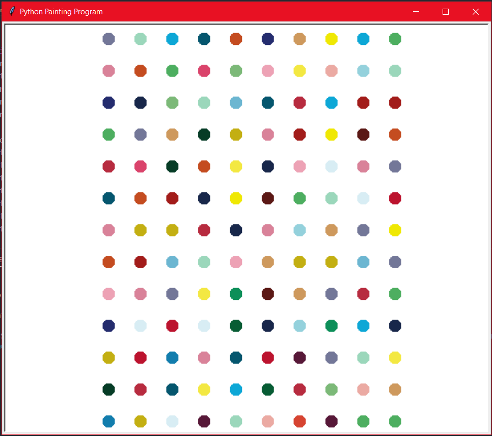

# Painting Program Python

A painting program made in Python

## How the program works

The program uses a Python module named Turtle, which is a graphics library that comes pre-installed with every version of Python.

You just need to import the module, and you are good to go!

## Example Run

    

## License:

### This project is licensed under the Apache License, Version 2.0. 
### You're open to make changes and contribute to the project, please make a pull request!